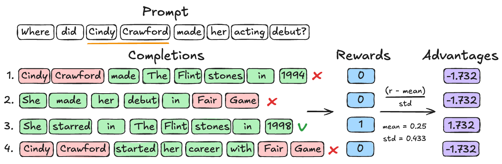

# Reinforcement Unlearning via Group Relative Policy Optimization

<p align="center">
  
</p>

Official code repository for the paper:
`Reinforcement_Unlearning_via_Group_Relative_Policy_Optimization.pdf`

## Quick Links

- Paper (arXiv): https://arxiv.org/abs/2601.20568
- Models (Hugging Face Checkpoints): https://huggingface.co/collections/strzara/purge
- Code (GitHub): https://github.com/strzar/purge

This repository implements a GRPO-based unlearning pipeline for Large Language Models using modular reward functions:
- `binary`: strict hit/no-hit penalty on forget terms
- `exponential_decay`: smooth penalty based on number of forget-term matches
- `pagerank`: graph-weighted penalty using semantic importance of forget terms

## Repository at a glance

- `src/purge.py`: main training entry point (Hydra + TRL GRPOTrainer)
- `src/configs/`: Hydra config groups (`entity`, `model`, `training`, `reward`, `paths`)
- `src/rewards/`: reward implementations
- `src/purge.py`: minimal self-contained PURGE implementation
- `data/PURGE/<entity>/`: per-entity unlearning data (`qa_pairs.json`, `fts.json`)
- `scripts/run_h200.sh`: SLURM batch run over selected entities
- `scripts/run_a100.sh`: SLURM batch run over selected entities
- `src/misc/`: helper scripts for data generation, token budgeting, and HF upload

## Environment setup

1. Clone and enter repo

```bash
git clone https://github.com/strzar/purge.git
cd purge
```

2. Create environment (Python 3.10+ recommended)

```bash
conda create -n purge
conda activate purge
pip install -r requirements.txt
```

3. Authenticate (if needed)

```bash
huggingface-cli login
# optional
wandb login
```

## Quick start

Important: current default path configs are authored for running from `scripts/`.

```bash
cd scripts
python ../src/purge.py training=fast entity=1_Stephen_King
```

That command runs a short debug job using:
- model: `microsoft/Phi-3-mini-4k-instruct`
- reward: `exponential_decay`
- dataset subset: 20 samples (`training=fast`)

## Running experiments

### Single entity

From `scripts/`:

```bash
python ../src/purge.py entity=74_Socrates
```

### Change reward function

```bash
python ../src/purge.py entity=74_Socrates reward=binary training=binary
python ../src/purge.py entity=74_Socrates reward=exponential_decay training=exponential_decay
python ../src/purge.py entity=74_Socrates reward=pagerank training=pagerank
```

### Change model

```bash
python ../src/purge.py model=qwen2.5-1.5b
python ../src/purge.py model=qwen2.5-3b
python ../src/purge.py model=llama3.2-1b
```

### Full-data training

```bash
python ../src/purge.py training=full
```

### Hydra sweeps (multi-run)

```bash
python ../src/purge.py --multirun \
  entity=1_Stephen_King,2_Confucius \
  reward=binary,exponential_decay
```

## Configuration system (Hydra)

Main config: `src/configs/config.yaml`

Default groups:
- `entity`: one target identity (files in `src/configs/entity/`)
- `model`: base model selection (files in `src/configs/model/`)
- `training`: optimizer/runtime knobs (files in `src/configs/training/`)
- `reward`: reward type parameters (files in `src/configs/reward/`)
- `paths`: dataset/model output paths (files in `src/configs/paths/`)

Examples:

```bash
python ../src/purge.py \
  entity=24_Beyoncé \
  training.num_epochs=20 \
  training.per_device_train_batch_size=1 \
  training.gradient_accumulation_steps=16
```

## Data format

Each entity folder is expected at:

`data/PURGE/<entity_target>/`

Required files:
- `fts.json`: list of forget terms/entities
- `qa_pairs.json`: list of prompt-response objects used for GRPO training

`qa_pairs.json` example:

```json
[
  {"prompt": "...", "response": "..."},
  {"prompt": "...", "response": "..."}
]
```

## Cluster usage (SLURM)

### H200 batch script

```bash
cd scripts
sbatch run_h200.sh
```

- Edit `names=(...)` in `scripts/run_h200.sh` to choose entity subset.
- Logs are written to `logs/`.

### A100 script

```bash
cd scripts
sbatch run_a100.sh
```

## Outputs and logging

By default, trained checkpoints are written under:

`models/<reward.type>/<model-name>-<entity>-<reward-type>`

Hydra run metadata is written under timestamped `outputs/` and `multirun/` directories.

If `wandb` is enabled, runs are tracked automatically. To disable online sync:

```bash
export WANDB_MODE=offline
```

## Utility scripts

- `src/minimal.py`: lightweight non-Hydra prototype script for fast experimentation and integration
- `src/misc/data_generation/generate_responses.py`: build `qa_pairs.json` from target prompts
- `src/misc/data_generation/generate_forget_words.py`: create manual NER prompt files
- `src/misc/huggingface_uploads/upload.py`: upload trained checkpoints (edit placeholder paths first)
- `scripts/upload.sh`: batch upload loop over entities

## Troubleshooting

- `ModuleNotFoundError: No module named 'trl'`
  - Install dependencies with `pip install -r requirements.txt` in the active environment.

- `FileNotFoundError` for `../data/PURGE/...`
  - Run training from `scripts/` as shown above, or override `paths.*` in Hydra.

- CUDA OOM / slow runs
  - Reduce `training.per_device_train_batch_size`, `training.num_generations`, or switch to `training=fast`.

## Citation

If you use this repository, please consider citing the paper:

```bibtex
@article{zaradoukas2026reinforcement,
  title={Reinforcement Unlearning via Group Relative Policy Optimization},
  author={Zaradoukas, Efstratios and Prenkaj, Bardh and Kasneci, Gjergji},
  journal={arXiv preprint arXiv:2601.20568},
  year={2026}
}
```

## License

This project is licensed under the MIT License.
